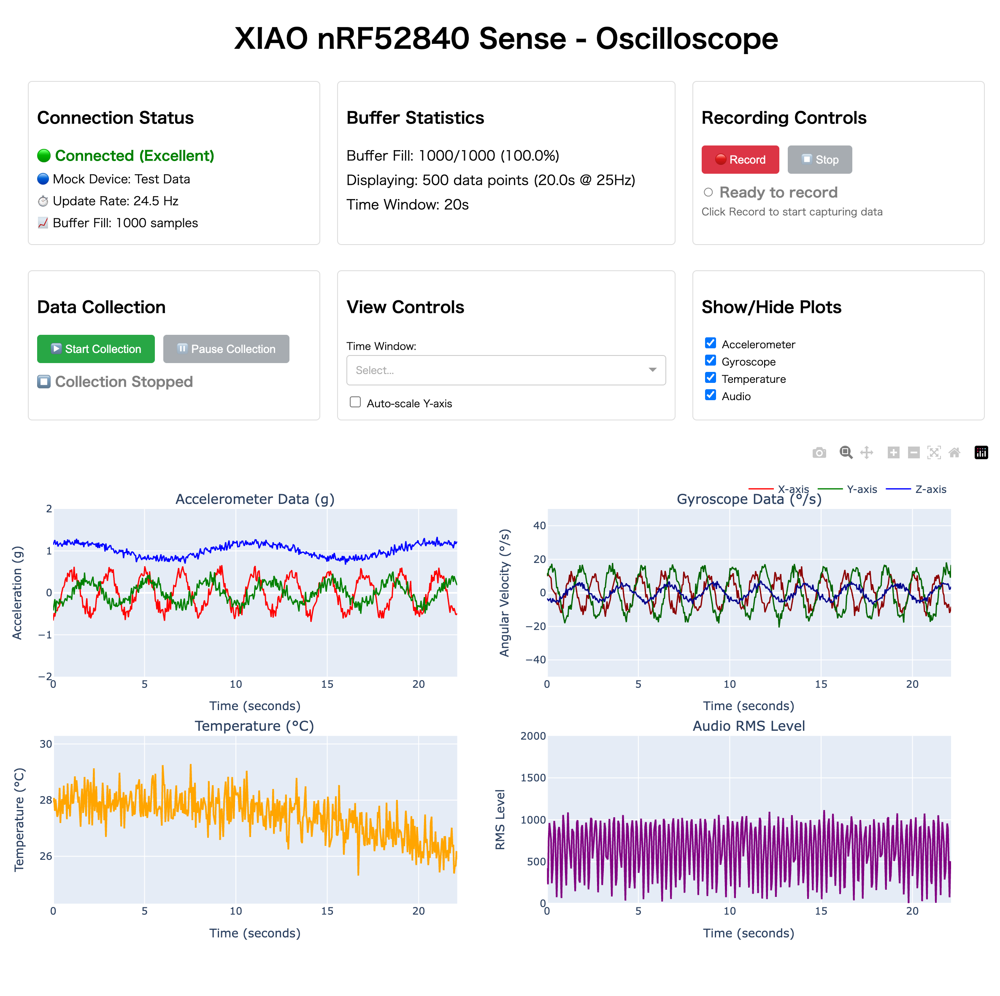

# XIAO nRF52840 Sense データロガー

<!-- Language Switcher -->
**Languages**: [English](./README.md) | [日本語](./README.ja.md)

---

## 🚀 概要

XIAO nRF52840 Sense マイクロコントローラー用の2コンポーネント構成センサーデータロガーシステムです。IMU（加速度/ジャイロ）とPDMマイクロフォンデータを収集し、リアルタイムWebオシロスコープ可視化またはCSVデータエクスポート機能をBLEとUSBシリアル経由で提供します。

### システム構成

- **Sender**: XIAO nRF52840 Sense上で動作するC++/Arduinoファームウェア
- **Receiver**: WebオシロスコープインターフェースとCSVエクスポート機能付きPython BLEクライアント

## 📦 コンポーネント

### [Sender（ファームウェア）](./sender/)
- **ハードウェア**: LSM6DS3 IMUとPDMマイクロフォン搭載のXIAO nRF52840 Sense
- **フレームワーク**: Arduino + PlatformIO
- **出力**: BLE Nordic UARTサービスとUSBシリアル経由のCSVデータ
- **データレート**: シリアル経由〜100Hz、BLE経由〜25Hz

### [Receiver（Pythonツール）](./receiver/)
- **プラットフォーム**: Python 3.12+ with uvパッケージマネージャー
- **デフォルトモード**: リアルタイムセンサープロット付きインタラクティブWebオシロスコープ
- **CSVモード**: フィルタリングオプション付きコマンドラインデータエクスポート
- **依存関係**: bleak（BLE）、dash（Web UI）、plotly（可視化）、pandas（データ）

## 🚀 クイックスタート

### 前提条件

- **ハードウェア**: XIAO nRF52840 Senseボード
- **ソフトウェア**: 
  - PlatformIO Core（ファームウェア開発）
  - Python 3.12+ with uv（データ受信）
  - Bluetoothアダプタ（BLE受信用）

### 1. ファームウェアセットアップ

```bash
cd sender/
pio run                    # ファームウェアビルド
pio run -t upload         # アップロード（DFUモード必要 - リセットボタン2回押し）
pio device monitor -b 115200  # シリアル出力監視
```

### 2. データ受信

#### Webオシロスコープ（デフォルト）
```bash
cd receiver/
uv sync                   # 依存関係インストール
uv run xiao-nrf52840-sense-receiver          # Webインターフェース起動
```

**📊 オシロスコープにアクセス**: ブラウザで [http://localhost:8050](http://localhost:8050) を開く



Webインターフェースの機能:
- **リアルタイムセンサープロット**: 加速度計、ジャイロスコープ、温度、音声データ
- **インタラクティブ制御**: パン、ズーム、自動スケール、プロット表示切替
- **記録機能**: タイムスタンプ付きデータセッション記録
- **接続状態**: BLE接続の健全性をリアルタイム監視

#### CSVエクスポートモード
```bash
uv run xiao-nrf52840-sense-receiver --csv --no-header --drop-missing-audio
```

## 📊 データ形式

9フィールドのCSV出力:
```
millis,ax,ay,az,gx,gy,gz,tempC,audioRMS
```

- **millis**: タイムスタンプ（起動からのミリ秒）
- **ax,ay,az**: 加速度計（g）
- **gx,gy,gz**: ジャイロスコープ（dps）  
- **tempC**: 温度（°C）
- **audioRMS**: オーディオRMS値（10msウィンドウ、欠損データは-1.0）

## 🔧 開発

### ファームウェア開発
詳細なファームウェア開発手順については[sender/README.md](./sender/README.md)を参照してください。

### Pythonツール開発  
Python開発ガイドラインとAPI文書については[receiver/README.md](./receiver/README.md)を参照してください。

## 🎯 使用例

### リアルタイム監視
- **ライブオシロスコープ**: リアルタイムセンサー可視化のためのインタラクティブWebインターフェース
- **動作解析**: ロボティクスと動作研究のためのIMUデータモニタリング
- **音響監視**: 加速度計コンテキストによる環境音レベル追跡

### データ収集・解析
- **CSVデータエクスポート**: フィルタリングとエクスポートオプション付き長期データロギング
- **IoTプロトタイピング**: BLE接続によるワイヤレスセンサーデータ収集
- **教育プロジェクト**: センサーデータ解析と信号処理研究

## 🛠 システム要件

### ハードウェア
- XIAO nRF52840 Senseボード
- プログラミングとシリアル通信用のUSB-Cケーブル
- Bluetooth Low Energyサポートのあるコンピューター

### ソフトウェア
- **ファームウェア**: PlatformIO Core、Git
- **データ受信**: Python 3.12+、uvパッケージマネージャー
- **OS対応**: Windows、macOS、Linux（BLEスタック依存）

## 📄 ライセンス

このプロジェクトはMITライセンスの下でライセンスされています。詳細は[LICENSE](LICENSE)ファイルを参照してください。

## 🤝 貢献

1. リポジトリをフォーク
2. フィーチャーブランチを作成（`git checkout -b feature/amazing-feature`）
3. 変更をコミット（`git commit -m 'Add amazing feature'`）
4. ブランチにプッシュ（`git push origin feature/amazing-feature`）
5. プルリクエストを開く

## 📞 サポート

技術サポートと質問については：
- `sender/`と`receiver/`のコンポーネント固有のREADMEファイルを確認
- ハードウェア文書の確認: [XIAO nRF52840 Sense](https://wiki.seeedstudio.com/XIAO_BLE_Sense/)
- GitHub Issuesでの問題報告
